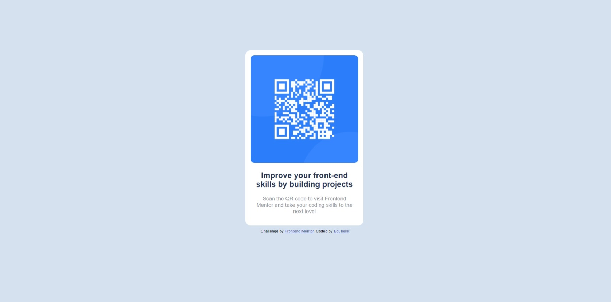

# Frontend Mentor - QR code component solution

This is a solution to the [QR code component challenge on Frontend Mentor](https://www.frontendmentor.io/challenges/qr-code-component-iux_sIO_H). Frontend Mentor challenges help you improve your coding skills by building realistic projects. 

## Table of contents

- [Overview](#overview)
  - [Screenshot](#screenshot)
  - [Links](#links)
- [My process](#my-process)
  - [Built with](#built-with)
  - [Continued development](#continued-development)
- [Author](#author)

## Overview

### Screenshot

### Links

- Solution URL: https://www.frontendmentor.io/solutions/qr-code-component-solution-htmlcss-eduherik-HydXAyZQ5
- Live Site URL: https://eduherik.github.io/QR-code-component-solution/

## My process

### Built with

- Semantic HTML5 markup
- CSS 

### Continued development

- Well, i want to learn about CSS media query and start javascript.

## Author

- Frontend Mentor - [@Eduherik](https://www.frontendmentor.io/profile/Eduherik)
- Github - [@Eduherik](https://github.com/Eduherik)

